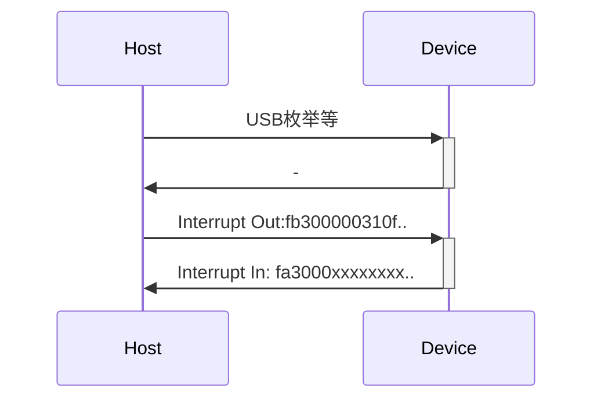

# DP100 Power Supplier USB protocol reverse engineering


设备：正点原子DP100,协议逆向。

本人主力使用MacOS，辅助用linux，较少用Windows。

由于正点原子只提供了 Windows平台 .net的 Dll，导致二次开发极其不方便。

所以准备逆向看看底层通讯协议如何实现，然后使用其他语言做porting。

## Protocol 解析

### USB 枚举信息

使用了HID协议。虽然不是HID但是是个HID Class

```
ID 2e3c:af01
  Configure:0, Interface:0, Setting:0
    Endpoint: Address: 81, Direction: IN, Transfer Type: Interrupt
    Endpoint: Address: 01, Direction: OUT, Transfer Type: Interrupt
```

### USB传输项

| 项目                   | 值       | 备注                                                         |
| ---------------------- | -------- | ------------------------------------------------------------ |
| USB Class              | 0x03 HID | 无需传送usage直接裸传数据                                    |
| HID usage              | 无       | 1.1版本会送一个 64byte的application本身意义不明<br>1.2直接删除了 |
| USB Packet Data Length | 固定64   | 如果内容的Package长度小雨64，可以用0补齐，也可以不管         |

### 传输协议

| 项目       | 值   |      |
| ---------- | ---- | ---- |
| 传输大小端 | 小端 |      |

### Package Layout

| Byte | 0        | 1      | 2       | 3    | ...       | len+4 | len+5 |
| ---- | -------- | ------ | ------- | ---- | --------- | ----- | ----- |
| 含义 | 传输方向 | OpCode | Reserve | Len  | Len个data | crc16 | crc16 |
| 说明 | fa/fb    | 操作   | 00      |      |           | LOW   | HIGH  |

例子

`fb300000310f00000000000000000000000000000000000000000000000000000000000...`

#### 传输方向

Host传Device时 为`0xfb`

Device传Host时为 `0xfa`

#### OpCode

| OpCode | 说明        |      |
| ------ | ----------- | ---- |
| 0x10   | DEVICE_INFO |      |
| 0x12   | START_TRANS |      |
| 0x13   | DATA_TRANS  |      |
| 0x14   | END_TRANS   |      |
| 0x15   | DEV_UPGRADE |      |
| 0x30   | BASIC_INFO  |      |
| 0×35   | BASIC_SET   |      |
| 0×40   | SYSTEM_INFO |      |
| 0x45   | SYSTEM_SET  |      |
| 0x50   | SCAN_OUT    |      |
| 0x55   | SERIAL_OUT  |      |
| 0x80   | DISCONNECT  |      |

至于每个OpCode的用法下面章节展开

#### Len

字面意思就是后面跟的数据长度，至于怎么判定要看OpCode

#### Data

实际承载的数据内容，根据OpCode不同含义不同，下面展开

#### CRC

E2E验证方式  CRC-16/MODBUS, Payload为第一byte 到Data结束

注意是小端的，即算出1234，传输要改成0x34 0x12。

### 时序




## OpCode

下面的信息是从dll dump出来的。**！！！！没有经过测试和验证！！！！**，请用挑错的眼光来查看一下内容

### 0x10 DEVICE_INFO

Host 发送Len = 0

Device发送数据如下

| 名称     | 类型      |      |
| -------- | --------- | ---- |
| dev type | uint8[16] |      |
| hdw_ver  | uint16    | origin:11 means 1.1     |
| app_ver  | uint16    | origin:11 means 1.2     |
| boot_ver | uint16    |      |
| run_area | uint16    |      |
| dev_sn   | uint8[12] |      |
| year     | uint16    |      |
| moon     | uint8     |      |
| day      | uint8     |      |

### 0x12  START_TRANS

未测试，大概是

Host 发送Len = 0

Device发送Len = 0

### 0x13  DATA_TRANS

未知

### 0x14  END_TRANS

未测试，大概是

Host 发送Len = 0

Device发送Len = 0

### 0x15  DEV_UPGRADE

未知，简单Decompile没找到相关信息，不是我研究重点没有深究。

### 0x30  BASIC_INFO

Host 发送Len = 0

Device发送

| 名称 | 类型 | |
|----|--|--|
| vin | uint16 | |
| vout | uint16 | |
| iout |uint16 | |
| vo_max | uint16 | |
| temp1 |uint16 | |
| temp2 |int16 | |
| dc 5V |uint16 | |
| out mode |uint8 | 这个枚举具体多少没试 |
| work st | uint8 | 这个枚举具体多少没试 |

### 0×35 BASIC_SET 
This is not set basic info.
There is a list of `Basic Set`,10 set is storaged in device.

#### Query
Host sending len = 1

| name    | type   |      |
| ------- | ------ | ---- |
| index   | uint8  |      |

to query the `Basic Set`,the device responses.

higher 4bit of index is flags,seems defined as below

index=80,to query activated one

#### Set
`Basic Set` has a structure below
| 名称    | 类型   |      |
| ------- | ------ | ---- |
| index   | uint8  |      |
| state   | uint8  | 0=off<br/>1=on    |
| vo_set  | uint16 |      |
| io_set  | uint16 |      |
| ovp_set | uint16 |      |
| ocp_set | int16  |      |

index=20,modify the set
index=80,set as activated
index=a0,modify the set,set as activated

when Host sending len = 16,and the payload is `Basic Set`, it means host request to set the `Basic Set`.

The Device reply as 
| 名称    | 类型   |      |
| ------- | ------ | ---- |
| result   | uint8  | 1 = ok |


### 0×40 SYSTEM_INFO

Host 发送Len = 0

Device发送

| 名称    | 类型   |      |
| ------- | ------ | ---- |
| blk_lev | int8   |  backlight    |
| opp     | uint16 |  over power    |
| opt     | uint16 |  over temperature    |
| vol_lev | int8   |  beep volumn    |

### 0x45 SYSTEM_SET

未知

### 0x50 SCAN_OUT

Host 发送

| 名称      | 类型     |       |
| --------- | -------- | ----- |
| on_off    | ?1 byte? |       |
| on_time   | uint16   |       |
| out_val   | uint16   |       |
| scan_mode | ?1 byte? | I / V |
| start     | uint16   |       |
| end       | uint16   |       |
| step      | uint16   |       |

Device发送 未测试

### 0x55 SERIAL_OUT

这个功能没太理解，后面有人对照着UI再说吧，此件不是本项目目标。

Host 发送

| 名称        | 类型   |      |
| ----------- | ------ | ---- |
| on_off      | uint8  |      |
| on_time     | uint16 |      |
| ser_start   | uint8  |      |
| ser_end     | uint8  |      |
| ser_vi      | uint16 |      |
| ser_vo      | uint16 |      |
| cycle_times | uint8  |      |

Device发送 未测试

### 0x80 DISCONNECT

未测试，大概是

Host 发送Len = 0

Device发送Len = 0
